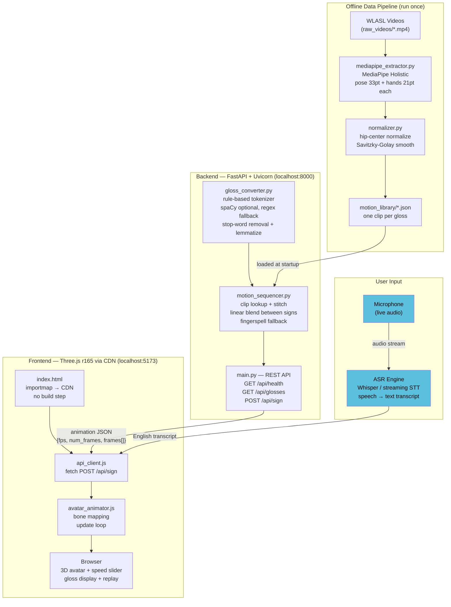
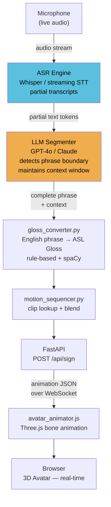
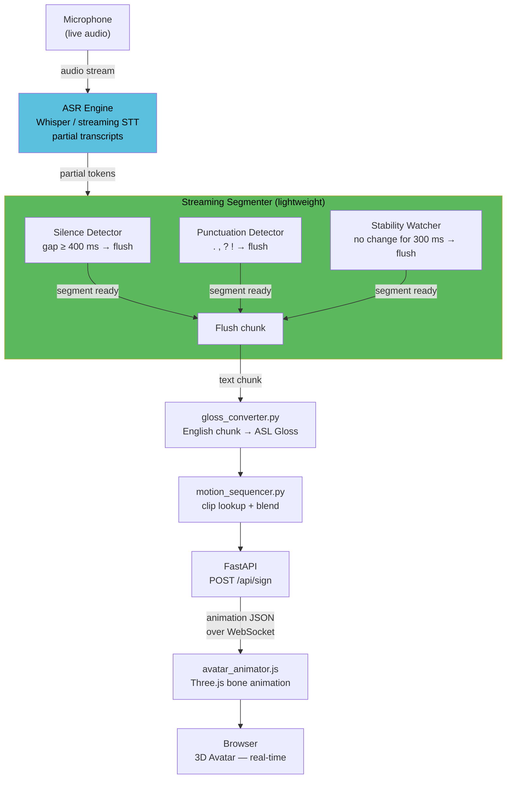
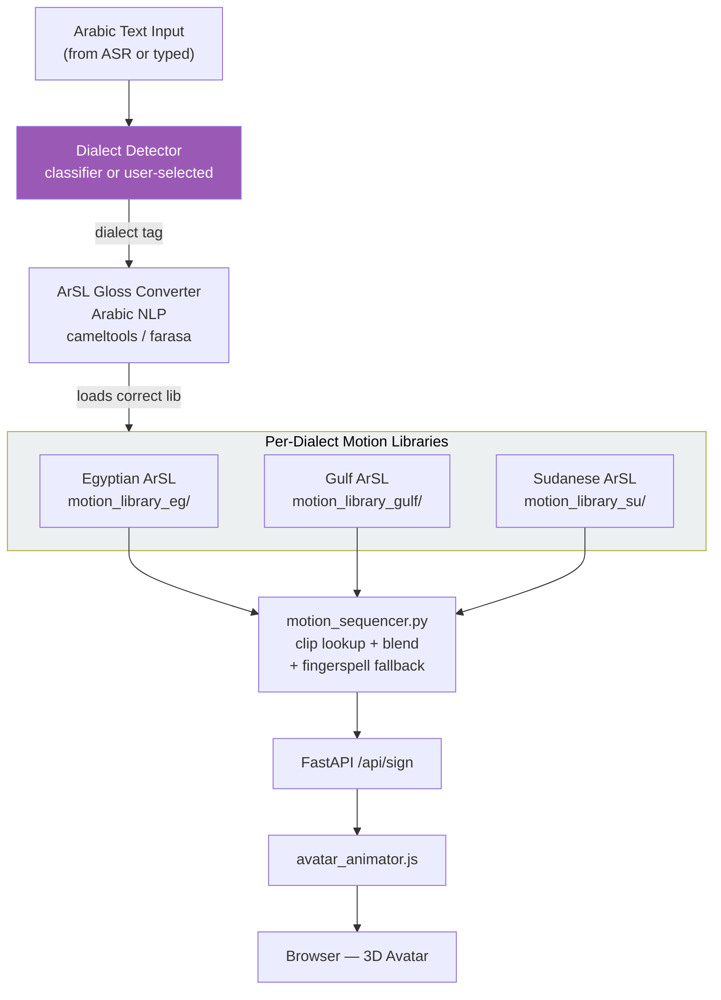
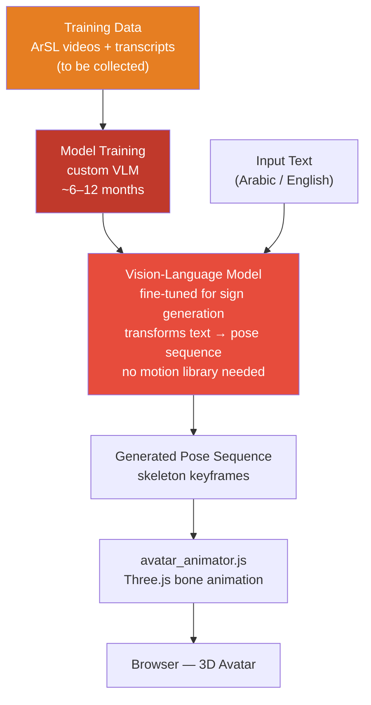

# AI Sign Language Avatar

A real-time system that converts spoken English (via ASR) into ASL skeleton animations played by a 3D avatar in the browser.

> Full multi-phase implementation plan (architecture, roadmap, testing guide) → [`plan.md`](plan.md)

---

## Current Architecture (Phase 1 — Implemented)

What is running right now, built from the actual source files:



### What each file does today

| File | Role | Notes |
|---|---|---|
| `data_pipeline/mediapipe_extractor.py` | Video → skeleton JSON | Pose (33 joints) + left/right hand (21 joints each) |
| `data_pipeline/normalizer.py` | Normalize + smooth | Hip-center origin, unit height, Savitzky-Golay filter |
| `data_pipeline/batch_process.py` | Batch driver | Processes all raw videos → `motion_library/` |
| `backend/gloss_converter.py` | English → ASL gloss | Rule-based; uses spaCy if installed, regex fallback otherwise |
| `backend/motion_sequencer.py` | Clip stitching | Linear blend transitions; fingerspell fallback for unknown tokens |
| `backend/main.py` | FastAPI server | `/api/health`, `/api/glosses`, `/api/sign` |
| `frontend/avatar_animator.js` | Bone animation | MediaPipe landmark index → Three.js bone position |
| `frontend/api_client.js` | API bridge | `fetch` to `localhost:8000/api/sign` |
| `frontend/main.js` | Three.js scene | Camera, lighting, render loop, speed control |
| `frontend/index.html` | Entry point | importmap loads Three.js r165 from CDN — no npm needed |

### What is NOT yet implemented (planned in later phases)

| Feature | Planned phase |
|---|---|
| Cosine / spring-damper transition blending | Phase 1d / Phase 3d |
| Fingerspell clips (A–Z) | Phase 1 |
| Voice input (Whisper ASR) | Phase 3 |
| Redis caching | Phase 2 |
| WebSocket streaming | Phase 2 |
| Full FK/IK bone solver | Phase 3a |
| Facial expressions / BlendShapes | Phase 3c |
| Docker + Kubernetes deployment | Phase 2 |

---

## Quick Start

> **Python version**: MediaPipe requires **Python 3.10–3.12**. Python 3.13 does not expose `mp.solutions.holistic.Holistic`.

### 1 — Set up environment

```powershell
python -m venv .venv
.venv\Scripts\Activate.ps1
```

### 2 — Install data-pipeline dependencies

```powershell
pip install -r data_pipeline/requirements-phase1.txt
```

### 3 — Build the motion library

Run from the repo root after downloading WLASL videos into `WLASL-master/start_kit/raw_videos/`:

```powershell
python data_pipeline/batch_process.py `
    --index WLASL-master/start_kit/WLASL_v0.3.json `
    --raw-videos WLASL-master/start_kit/raw_videos `
    --out-dir backend/motion_library `
    --max-per-gloss 5
```

Outputs:
- `backend/motion_library/*.json` — one selected clip per gloss
- `backend/motion_library/report.json` — summary of written / skipped glosses

**Dry run first** (no file writes):
```powershell
python data_pipeline/batch_process.py --dry-run
```

### 4 — Install backend dependencies

```powershell
pip install -r backend/requirements.txt
python -m spacy download en_core_web_sm
```

### 5 — Start the backend

```powershell
cd backend
uvicorn main:app --reload --port 8000
```

Verify:
```powershell
curl http://localhost:8000/api/health
# {"status":"ok","motion_library_size":<N>}
```

### 6 — Start the frontend

No npm or build step — Three.js loads from CDN via importmap. You only need any static file server:

```powershell
# Option A — Python (simplest)
cd frontend
python -m http.server 5173

# Option B — VS Code Live Server
# Right-click frontend/index.html → Open with Live Server

# Option C — Node
npx serve frontend -p 5173
```

Open `http://localhost:5173`, type a sentence, click **Sign it ▶**.

---

## Troubleshooting

| Symptom | Fix |
|---|---|
| `AttributeError: module 'mediapipe' has no attribute 'solutions'` | Switch to Python 3.10–3.12 |
| `motion_library_size: 0` from `/api/health` | Run Step 3 first |
| `404` from `/api/sign` — "None of the gloss tokens found" | Words not in library — check `report.json` for skipped glosses |
| `ModuleNotFoundError: spacy` | `pip install spacy && python -m spacy download en_core_web_sm` |
| Browser shows blank canvas | Must serve via HTTP, not `file://` — use Step 6 |
| Avatar doesn't move | Check browser DevTools console for a failed fetch to `localhost:8000` |

---

## Suggested Architectures

The following architectures address two core technical challenges identified during development:

1. **Real-time processing** — the current system waits for a complete sentence before translating, causing latency during live speech.
2. **Arabic sign language data scarcity** — limited datasets, plus dialect variation (Egyptian, Gulf/Saudi, Sudanese), make a unified model harder to build.

---

### Challenge 1 — Real-time Speech-to-Sign (Two Solutions)

#### Solution A — LLM-Assisted Segmentation

An LLM layer sits between the ASR output and the Gloss converter. It reads the streaming token stream, decides when a meaningful phrase is complete, and forwards only that chunk for sign translation — preserving cross-phrase context.

**Trade-offs:** higher API cost, extra latency per LLM call, accuracy depends on model context quality.



#### Solution B — Streaming Segmentation (Silence / Punctuation Detection)

Instead of an LLM, the stream is split into chunks using lightweight heuristics already available in the ASR output. Each chunk is sent directly to the Gloss converter.

**Segmentation triggers:**
- Speaker pauses (silence gap ≥ threshold, e.g. 400 ms)
- Punctuation characters (`. , ? !`) appear in the partial transcript
- Transcript text is stable (no token change) for a short window (e.g. 300 ms)

**Trade-offs:** lower cost, simpler implementation, but real-world accuracy depends on segmentation quality — best validated through testing.



---

### Comparison — Solution A vs Solution B

| Dimension | Solution A — LLM Segmenter | Solution B — Streaming Segmentation |
|---|---|---|
| Segmentation accuracy | High (context-aware) | Medium (heuristic-based) |
| Implementation complexity | Medium | Low |
| Latency | Higher (LLM round-trip) | Lower (local heuristics) |
| Cost | Higher (LLM API calls) | Near zero |
| Arabic dialect handling | Strong (LLM generalises) | Depends on ASR punctuation |
| Best for | Production / accuracy-first | MVP / speed-first |

---

### Challenge 2 — Arabic Sign Language Data Scarcity

Arabic Sign Language (ArSL) has no large public dataset, and signs vary by dialect:

| Dialect | Region |
|---|---|
| Egyptian ArSL | Egypt |
| Gulf / Saudi ArSL | KSA, UAE, Kuwait, Qatar |
| Sudanese ArSL | Sudan |

The architecture below shows how the existing pipeline would extend to support ArSL, with a dialect router and separate motion libraries per dialect.



---

### Future Alternative — End-to-End Vision-Language Model

> **Status: Research stage — estimated 6–12 months of development.**

A generative model that produces sign animations directly from text, with **no pre-built motion library**. Requires a large dataset and a custom-trained Vision-Language Model (VLM).

**Requirements:**
- Large ArSL video dataset (currently unavailable publicly)
- Custom VLM fine-tuned on sign generation
- Significant compute for training


