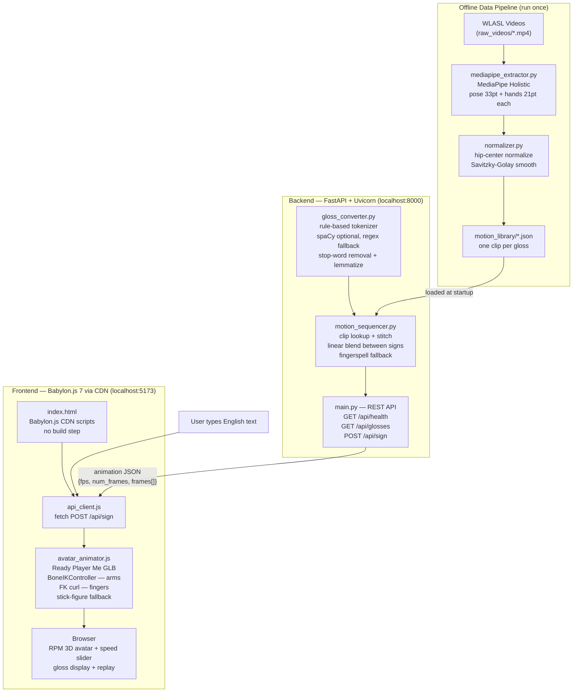

# AI Sign Language Avatar

A real-time system that converts English text into ASL skeleton animations played by a 3D avatar in the browser.

> Full multi-phase implementation plan (architecture, roadmap, testing guide) → [`plan.md`](plan.md)

---

## Current Architecture (Phase 1 — Implemented)

What is running right now, built from the actual source files:



### What each file does today

| File | Role | Notes |
|---|---|---|
| `data_pipeline/mediapipe_extractor.py` | Video → skeleton JSON | Pose (33 joints) + left/right hand (21 joints each) |
| `data_pipeline/normalizer.py` | Normalize + smooth | Hip-center origin, unit height, Savitzky-Golay filter |
| `data_pipeline/batch_process.py` | Batch driver | Processes all raw videos → `motion_library/` |
| `backend/gloss_converter.py` | English → ASL gloss | Rule-based; uses spaCy if installed, regex fallback otherwise |
| `backend/motion_sequencer.py` | Clip stitching | Linear blend transitions; fingerspell fallback for unknown tokens |
| `backend/main.py` | FastAPI server | `/api/health`, `/api/glosses`, `/api/sign` |
| `frontend/avatar_animator.js` | Bone animation | Babylon.js: BoneIKController for arms, FK curl for fingers, spine/head FK |
| `frontend/api_client.js` | API bridge | `fetch` to `localhost:8000/api/sign` |
| `frontend/main.js` | Babylon.js scene | Engine, ArcRotateCamera, lighting, render loop, speed control |
| `frontend/index.html` | Entry point | Babylon.js 7 loaded from CDN — no npm or build step needed |

### What is NOT yet implemented (planned in later phases)

| Feature | Planned phase |
|---|---|
| Cosine / spring-damper transition blending | Phase 1d / Phase 3d |
| Fingerspell clips (A–Z) | Phase 1 |
| Voice input (Whisper ASR) | Phase 3 |
| Redis caching | Phase 2 |
| WebSocket streaming | Phase 2 |
| Full FK/IK bone solver | Phase 3a |
| Facial expressions / BlendShapes | Phase 3c |
| Docker + Kubernetes deployment | Phase 2 |

---

## Quick Start

> **Python version**: MediaPipe requires **Python 3.10–3.12**. Python 3.13 does not expose `mp.solutions.holistic.Holistic`.

### 1 — Set up environment

```powershell
python -m venv .venv
.venv\Scripts\Activate.ps1
```

### 2 — Install data-pipeline dependencies

```powershell
pip install -r data_pipeline/requirements-phase1.txt
```

### 3 — Build the motion library

Run from the repo root after downloading WLASL videos into `WLASL-master/start_kit/raw_videos/`:

```powershell
python data_pipeline/batch_process.py `
    --index WLASL-master/start_kit/WLASL_v0.3.json `
    --raw-videos WLASL-master/start_kit/raw_videos `
    --out-dir backend/motion_library `
    --max-per-gloss 5
```

Outputs:
- `backend/motion_library/*.json` — one selected clip per gloss
- `backend/motion_library/report.json` — summary of written / skipped glosses

**Dry run first** (no file writes):
```powershell
python data_pipeline/batch_process.py --dry-run
```

### 4 — Install backend dependencies

```powershell
pip install -r backend/requirements.txt
python -m spacy download en_core_web_sm
```

### 5 — Start the backend

```powershell
cd backend
uvicorn main:app --reload --port 8000
```

Verify:
```powershell
curl http://localhost:8000/api/health
# {"status":"ok","motion_library_size":<N>}
```

### 6 — Download a Mixamo avatar

The frontend uses a Babylon.js-powered Mixamo-rigged avatar. You need one `.glb` file.

**Get the character (free):**
1. Go to **[mixamo.com](https://www.mixamo.com)** → sign in with a free Adobe account.
2. Pick any humanoid character (e.g. "Y Bot", "X Bot", or any human model).
3. Click **Download** → Format: **FBX**, Pose: **T-Pose** (no animation needed).

**Convert FBX → GLB with Blender (free):**
```
1. Open Blender → File → Import → FBX → select your downloaded file
2. File → Export → glTF 2.0 (.glb/.gltf)
   - Format: GLB
   - Include: Armature ✓  Mesh ✓
3. Save as  frontend/assets/avatar.glb
```

The bone names Mixamo uses (`LeftArm`, `LeftForeArm`, `LeftHandIndex1`, …) are exactly what `avatar_animator.js` targets — **no code changes needed**.

> If `avatar.glb` is missing, the app automatically falls back to a blue stick figure so you can still test motion logic.

### 7 — Start the frontend

No npm or build step — Babylon.js loads from CDN. You only need any static file server:

```powershell
# Option A — Python (simplest)
cd frontend
python -m http.server 5173

# Option B — VS Code Live Server
# Right-click frontend/index.html → Open with Live Server

# Option C — Node
npx serve frontend -p 5173
```

Open `http://localhost:5173`, type a sentence, click **Sign it ▶**.

> The RPM avatar will appear in the centre of the viewport. Drag to orbit, scroll to zoom.

---

## Troubleshooting

| Symptom | Fix |
|---|---|
| `AttributeError: module 'mediapipe' has no attribute 'solutions'` | Switch to Python 3.10–3.12 |
| `motion_library_size: 0` from `/api/health` | Run Step 3 first |
| `404` from `/api/sign` — "None of the gloss tokens found" | Words not in library — check `report.json` for skipped glosses |
| `ModuleNotFoundError: spacy` | `pip install spacy && python -m spacy download en_core_web_sm` |
| Browser shows blank canvas | Must serve via HTTP, not `file://` — use Step 6 |
| Avatar doesn't move | Check browser DevTools console for a failed fetch to `localhost:8000` |
