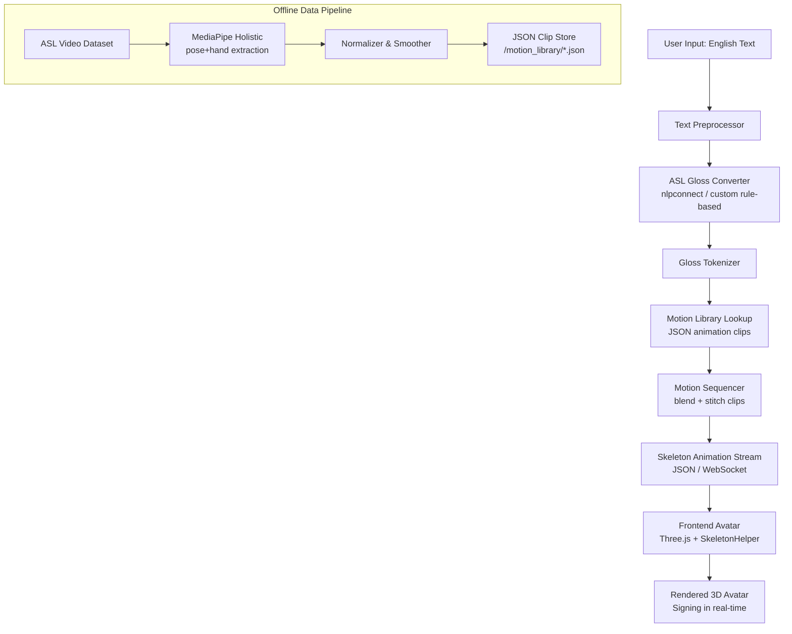

# AI Sign Language Avatar — Technical Implementation Plan

## Overview

A real-time system that converts English text into ASL (American Sign Language) sign animations played by a 3D avatar. The system targets **low latency** by avoiding generative/diffusion models in favor of a **skeleton-based animation library** built from real signer recordings.

---

## System Architecture



---

## Phase 1 — MVP

### Goals
- Accept English text input via a simple web UI.
- Convert to ASL gloss (rule-based, no ML models needed at MVP stage).
- Retrieve pre-recorded skeleton clips and stitch together.
- Display a basic 3D avatar performing the signs in the browser.

---

### 1. Data Pipeline — Building the Sign Motion Library

#### Step 1: Source ASL video datasets — **using WLASL daily-use subset**

For MVP we use the **`--preset daily`** subset of WLASL: ~100 high-frequency everyday signs downloaded with redundancy (5 copies each) to survive corrupted files.

**Download command** (run from `WLASL-master\start_kit\`):
```powershell
python fast_video_downloader.py `
    --index WLASL_v0.3.json `
    --out raw_videos `
    --workers 8 --retries 2 `
    --nonyoutube-only --insecure `
    --preset daily --max-per-gloss 5
```

**`--preset daily` covers ~100 words across 6 categories:**

| Category | Examples |
|---|---|
| Greetings / courtesy | hello, goodbye, please, thank, sorry, yes, no |
| Question words | what, where, when, who, why, how |
| Family / people | mother, father, sister, brother, friend, baby |
| Core verbs | help, want, need, like, love, go, eat, drink, sleep, work, play |
| Feelings / state | happy, sad, angry, sick, tired, good, bad, hot, cold |
| Food / time / colours | water, food, today, tomorrow, morning, night, red, blue, green |

> **Why `--max-per-gloss 5`?** Each word gets up to 5 video instances so that even if 3–4 are corrupted or dead links you still end up with at least 1 usable video per sign.

After downloading, downloaded videos land in `WLASL-master\start_kit\raw_videos\`. For Phase 2, expand to full WLASL (21,083 videos) or add MS-ASL/ASL-LEX.

| Dataset | Description | URL |
|---|---|---|
| **WLASL** | 2000 words, 21,083 videos from Deaf signers | [WLASL on GitHub](https://github.com/dxli94/WLASL) |
| **MS-ASL** | Microsoft, 1000 classes | [MS-ASL](https://www.microsoft.com/en-us/research/project/ms-asl/) |
| **ASL-LEX** | Lexical freq. database with video | [ASL-LEX](https://asl-lex.org/) |
| **Handspeak** | Free ASL videos for common words | [handspeak.com](https://www.handspeak.com/) |
| **OpenASL** | Open-source ASL data | [OpenASL](https://github.com/chevalierNoir/OpenASL) |

---

#### Step 2: MediaPipe Skeleton Extraction

Run `mediapipe_extractor.py` on every source video to extract:
- **Pose landmarks** (33 body joints)
- **Left/Right hand landmarks** (21 keypoints each)
- **Face landmarks** (optional for lip sync, Phase 2)

**Key MediaPipe API**: `mp.solutions.holistic.Holistic`

```python
import mediapipe as mp
import cv2, json, numpy as np

def extract_clip(video_path: str, output_path: str):
    mp_holistic = mp.solutions.holistic
    cap = cv2.VideoCapture(video_path)
    fps = cap.get(cv2.CAP_PROP_FPS)
    frames = []

    with mp_holistic.Holistic(
        static_image_mode=False,
        model_complexity=1,
        smooth_landmarks=True
    ) as holistic:
        while cap.isOpened():
            ret, frame = cap.read()
            if not ret:
                break
            rgb = cv2.cvtColor(frame, cv2.COLOR_BGR2RGB)
            result = holistic.process(rgb)
            frame_data = extract_landmarks(result)
            frames.append(frame_data)

    cap.release()
    clip = {"fps": fps, "frames": frames, "num_frames": len(frames)}
    with open(output_path, "w") as f:
        json.dump(clip, f)

def extract_landmarks(result) -> dict:
    def lm_to_list(lm_list):
        if lm_list is None:
            return None
        return [[lm.x, lm.y, lm.z] for lm in lm_list.landmark]

    return {
        "pose": lm_to_list(result.pose_landmarks),
        "left_hand": lm_to_list(result.left_hand_landmarks),
        "right_hand": lm_to_list(result.right_hand_landmarks),
    }
```

---

#### Step 3: Normalize and Smooth

- **Normalize**: Center all coordinates around the hip midpoint (pose landmark 23/24), scale to unit height. This makes the avatar size-independent.
- **Smooth**: Apply a Savitzky-Golay filter (window=5, poly=2) for jitter removal.

```python
from scipy.signal import savgol_filter
import numpy as np

def smooth_sequence(frames: list, window=5, poly=2) -> list:
    """Apply Savitzky-Golay filter per joint per axis."""
    arr = np.array([[f["pose"] for f in frames]])  # shape: (T, 33, 3)
    smoothed = savgol_filter(arr, window, poly, axis=0)
    return smoothed.tolist()
```

---

### 2. Skeleton Animation Storage Format

Each word/sign is stored as a single `.json` clip file:

```json
{
  "gloss": "HELLO",
  "source": "WLASL-v3",
  "fps": 30,
  "num_frames": 45,
  "joints": ["POSE_0", "POSE_1", "...", "L_HAND_0", "...", "R_HAND_0", "..."],
  "frames": [
    {
      "pose": [[x, y, z], ...],    // 33 joints
      "left_hand": [[x, y, z], ...],  // 21 joints, null if absent
      "right_hand": [[x, y, z], ...]  // 21 joints, null if absent
    }
  ]
}
```

Store these in: `motion_library/<GLOSS_TOKEN>.json`

---

### 3. Text → ASL Gloss Conversion

For MVP, use a **rule-based gloss converter**. ASL gloss follows different grammar than English (no articles, simplified verb forms). A basic approach:

1. **Tokenize** English sentence (spaCy or NLTK).
2. **Remove** articles (`a`, `an`, `the`), auxiliary verbs (`is`, `are`, `was`), and conjunctions.
3. **Lemmatize** words (e.g., `running` → `RUN`).
4. **Map** to gloss tokens (uppercase).
5. For unknown words: **fingerspell** letter-by-letter using the ASL fingerspelling library.

```python
import spacy
nlp = spacy.load("en_core_web_sm")

STOP_REMOVE = {"the", "a", "an", "is", "are", "was", "were", "be", "been"}

def text_to_gloss(sentence: str) -> list[str]:
    doc = nlp(sentence.lower())
    gloss = []
    for token in doc:
        if token.is_punct or token.text in STOP_REMOVE:
            continue
        lemma = token.lemma_.upper()
        gloss.append(lemma)
    return gloss
```

**Phase 2 upgrade**: Replace with a trained Seq2Seq transformer (e.g., mBART or T5 fine-tuned on English→ASL gloss corpora).

---

### 4. Motion Sequencer

Concatenates clips with a **linear blend** transition to avoid hard cuts:

```python
import numpy as np, json
from pathlib import Path

LIBRARY_PATH = Path("motion_library")
BLEND_FRAMES = 5

def load_clip(gloss: str) -> dict | None:
    path = LIBRARY_PATH / f"{gloss}.json"
    if path.exists():
        with open(path) as f:
            return json.load(f)
    return None

def blend_frames(clip_a_last, clip_b_first, n=BLEND_FRAMES):
    """Linear interpolation between end of clip A and start of clip B."""
    blended = []
    for i in range(n):
        alpha = i / n
        frame = {}
        for key in ["pose", "left_hand", "right_hand"]:
            a = np.array(clip_a_last[key] or np.zeros((21,3)))
            b = np.array(clip_b_first[key] or np.zeros((21,3)))
            frame[key] = ((1 - alpha) * a + alpha * b).tolist()
        blended.append(frame)
    return blended

def sequence_clips(gloss_tokens: list[str]) -> dict:
    all_frames = []
    last_frame = None
    for token in gloss_tokens:
        clip = load_clip(token)
        if clip is None:
            clip = fingerspell_clip(token)  # fallback
        if last_frame and clip["frames"]:
            all_frames += blend_frames(last_frame, clip["frames"][0])
        all_frames += clip["frames"]
        last_frame = clip["frames"][-1] if clip["frames"] else last_frame
    return {"fps": 30, "num_frames": len(all_frames), "frames": all_frames}
```

---

### 5. Backend Architecture

**Stack**: FastAPI (Python) + Uvicorn

```
POST /api/sign
Body: { "text": "Hello, how are you?" }
Response: { "gloss": ["HELLO", "HOW", "YOU"], "animation": { ...clip JSON... } }
```

```python
from fastapi import FastAPI
from pydantic import BaseModel

app = FastAPI()

class SignRequest(BaseModel):
    text: str

@app.post("/api/sign")
async def sign(req: SignRequest):
    gloss = text_to_gloss(req.text)
    animation = sequence_clips(gloss)
    return {"gloss": gloss, "animation": animation}
```

- For large animations, stream via **WebSocket** for better UX.
- Cache frequently requested animations in Redis (Phase 2).

---

### 6. Frontend — 3D Avatar Animation (Three.js)

**Rendering approach**: Three.js `SkeletonHelper` + bone-mapped avatar (GLB/GLTF format).

**Recommended free avatars**:
- [Ready Player Me](https://readyplayer.me/) — free GLB avatars
- [Mixamo](https://mixamo.com/) — free rigged characters

**Landmark → Bone Mapping**: Map MediaPipe joint indices to the avatar's skeleton bones. This is the core bridge step.

```javascript
// avatar_animator.js
import * as THREE from 'three';
import { GLTFLoader } from 'three/addons/loaders/GLTFLoader.js';

const POSE_BONE_MAP = {
  11: 'LeftUpperArm',
  12: 'RightUpperArm',
  13: 'LeftLowerArm',
  14: 'RightLowerArm',
  15: 'LeftHand',
  16: 'RightHand',
  23: 'LeftUpperLeg',
  24: 'RightUpperLeg',
};

class AvatarAnimator {
  constructor(scene, avatarUrl) {
    this.bones = {};
    this.frames = [];
    this.currentFrame = 0;
    this.fps = 30;
    this.loader = new GLTFLoader();
    this.loader.load(avatarUrl, (gltf) => {
      scene.add(gltf.scene);
      gltf.scene.traverse((obj) => {
        if (obj.isBone) this.bones[obj.name] = obj;
      });
    });
  }

  loadAnimation(animationData) {
    this.frames = animationData.frames;
    this.fps = animationData.fps;
    this.currentFrame = 0;
  }

  update(delta) {
    if (!this.frames.length) return;
    this.currentFrame = (this.currentFrame + delta * this.fps) % this.frames.length;
    const frame = this.frames[Math.floor(this.currentFrame)];
    this._applyPose(frame);
  }

  _applyPose(frame) {
    if (!frame.pose) return;
    for (const [idx, boneName] of Object.entries(POSE_BONE_MAP)) {
      const bone = this.bones[boneName];
      if (!bone || !frame.pose[idx]) continue;
      const [x, y, z] = frame.pose[idx];
      // Compute and apply rotation via IK or direct joint angles
      bone.position.set(x, y, z);
    }
  }
}
```

> **Note**: For production, use **inverse kinematics (IK)** to set bone rotations from joint positions (e.g., the `three-ik` library or custom FK/IK solver). For MVP, direct position setting gives a working prototype quickly.

---

### 7. Project Folder Structure

```
ai-sign-language-avatar/
├── backend/
│   ├── main.py                  # FastAPI entry point
│   ├── gloss_converter.py       # text → ASL gloss
│   ├── motion_sequencer.py      # clip stitching
│   ├── motion_library/          # pre-processed JSON clips
│   │   ├── HELLO.json
│   │   ├── HOW.json
│   │   └── ...
│   ├── fingerspell/             # A-Z fingerspelling clips
│   │   ├── A.json
│   │   └── ...
│   └── requirements.txt
│
├── data_pipeline/
│   ├── mediapipe_extractor.py   # video → skeleton JSON
│   ├── normalizer.py            # normalize + smooth
│   ├── batch_process.py         # process entire dataset
│   └── scripts/
│       └── download_wlasl.sh
│
├── frontend/
│   ├── index.html
│   ├── main.js                  # Three.js scene setup
│   ├── avatar_animator.js       # pose → bone animation
│   ├── api_client.js            # calls backend /api/sign
│   ├── assets/
│   │   └── avatar.glb           # Ready Player Me avatar
│   └── style.css
│
├── tests/
│   ├── test_gloss_converter.py
│   ├── test_motion_sequencer.py
│   └── test_api.py
│
└── README.md
```

---

### 8. MVP Step-by-Step Roadmap

| Step | Milestone | Status |
|------|-----------|--------|
| **1a** | Set up repo structure, install dependencies (MediaPipe, FastAPI, spaCy). | — |
| **1b** | Download WLASL daily-use subset: `--preset daily --max-per-gloss 5` (~500 videos queued). | ✅ Script ready |
| **2** | Build `mediapipe_extractor.py`. Run on `raw_videos/` → 100 JSON clips in `motion_library/`. Build normalizer/smoother. | — |
| **3** | Build `gloss_converter.py` (rule-based). Build `motion_sequencer.py` with linear blend. Test end-to-end text → animation JSON. | — |
| **4** | Build FastAPI backend. Test `POST /api/sign` endpoint with `curl` / pytest. | — |
| **5** | Set up Three.js scene. Load Ready Player Me avatar. Implement landmark → bone mapping. Render looping animation from JSON. | — |
| **6** | Connect frontend to backend. Display avatar signing from text input. Polish UI. Record demo. | — |

**Total estimated MVP time: 6 weeks (1 developer)**

---

## Phase 2 — Production

### Upgrades Over MVP

| Area | MVP | Phase 2 |
|------|-----|---------|
| **Gloss conversion** | Rule-based (spaCy) | Fine-tuned T5/mBART Seq2Seq model |
| **Motion library** | 100–500 words, hand-curated | 2000+ words (full WLASL vocabulary) |
| **Motion blending** | Linear interpolation | **Motion Graph** or **Neural motion matching** |
| **Avatar rendering** | Three.js with direct joint mapping | Full IK rig (Unity or Unreal Engine) |
| **Facial expression** | None | Lipsync + eyebrow/expression via BlendShapes |
| **Latency** | ~100–300ms | <50ms with streaming + caching |
| **Backend** | FastAPI synchronous | FastAPI async + Redis cache + WebSocket stream |
| **Deployment** | Local / dev server | Docker + Kubernetes + CDN |
| **Input modalities** | Text only | Text + Speech (Whisper ASR → ASL) |
| **Sign language** | ASL only | ASL + BSL + ISL (multilingual) |

---

### Phase 2 Architecture Additions

#### A. Improved Gloss Conversion (ML Model)
Train a **Seq2Seq transformer** on English→ASL gloss pairs from the [How2Sign dataset](https://how2sign.github.io/) or [Phoenix-2014T](https://www-i6.informatik.rwth-aachen.de/~koller/RWTH-PHOENIX-2014-T/).

```
English: "I want to eat pizza"
ASL Gloss: ["ME", "WANT", "EAT", "PIZZA"]
```

Use **HuggingFace** `transformers` for fine-tuning.

#### B. Motion Graph for Natural Blending
Instead of simple linear interpolation, build a **motion graph** — a directed graph where nodes are key-frames of clips and edges represent valid transitions (computed by distance metric on pose similarity). Traversal finds the path that produces the most natural animation.

#### C. IK-Based Avatar in Unity
Unity's **Animation Rigging** package (`com.unity.animation.rigging`) supports full IK. Use `TwoBoneIK` constraints for arms and hands. Receive skeleton data over WebSocket and drive bones in real-time.

#### D. Voice Input (ASR → ASL)
Add OpenAI Whisper as an ASR module upstream:

```
Microphone → Whisper (STT) → English text → Gloss → Avatar
```

#### E. Deployment Architecture

```
[Client Browser / Unity WebGL]
         |  WebSocket / HTTP
[API Gateway → FastAPI + Uvicorn (k8s pods)]
         |
[Redis Cache for animation clips]
         |
[Motion Library on S3 / object storage]
```

---

### Phase 2 Dataset Recommendations

| Dataset | Words/Phrases | Notes |
|---|---|---|
| **WLASL** | 2000 words | Best starting point |
| **How2Sign** | Continuous signing | Great for sentence-level |
| **Phoenix 2014-T** | Weather reports | German, but good for Seq2Seq training |
| **ASLLVD** | 3000+ ASL signs | Produced by Rutgers/Boston |
| **ChicagoFSWild** | Fingerspelling in the wild | Great for fingerspell fallback |
| **ASL-LEX** | ~2700 signs with metadata | Academic use |

---

## Key Dependencies

```
# backend/requirements.txt
fastapi>=0.111.0
uvicorn[standard]>=0.29.0
mediapipe>=0.10.14
opencv-python>=4.9.0
spacy>=3.7.4
scipy>=1.13.0
numpy>=1.26.4
redis>=5.0.4        # Phase 2
websockets>=12.0    # Phase 2

# NLP model
# python -m spacy download en_core_web_sm
```

```json
// frontend/package.json (Vite + Three.js)
{
  "dependencies": {
    "three": "^0.164.1",
    "vite": "^5.2.0"
  }
}
```

---

## Risks & Mitigations

| Risk | Mitigation |
|------|-----------|
| Landmark → bone mapping is inaccurate | Use FK/IK solver; test with multiple avatar rigs |
| MediaPipe fails on occluded hands | Filter low-confidence frames; fill gaps with interpolation |
| Gloss converter misses words | Fingerspell fallback for any unknown token |
| High latency on clip stitching | Pre-cache top-1000 common sentences; stream clips progressively |
| Choppy transitions between signs | Increase blend window; use motion graph in Phase 2 |
| Dataset licensing restrictions | WLASL is research-use; build custom clips for commercial use |

---

## Testing Guide

A layer-by-layer approach: verify each component independently before wiring everything together.

---

### Layer 0 — Verify Downloaded Videos

```powershell
# Count how many videos actually downloaded
(Get-ChildItem WLASL-master\start_kit\raw_videos -File).Count

# Spot-check a file is not zero bytes (corrupt)
Get-ChildItem WLASL-master\start_kit\raw_videos -File |
    Where-Object { $_.Length -lt 1000 } |
    Select-Object Name, Length
# Any files listed here are corrupt/incomplete — delete and re-run the downloader
```

Play a few videos manually to confirm they show a signer:
```powershell
# Open a random video in Windows Media Player
$vids = Get-ChildItem WLASL-master\start_kit\raw_videos -Filter *.mp4
Start-Process $vids[0].FullName
```

---

### Layer 1 — Test MediaPipe Skeleton Extraction

Run the extractor on a **single video** first:

```python
# data_pipeline/mediapipe_extractor.py
python data_pipeline/mediapipe_extractor.py \
    --video WLASL-master/start_kit/raw_videos/<some_video_id>.mp4 \
    --out backend/motion_library/TEST.json
```

Inspect the output JSON to confirm it has frames with pose/hand data:

```python
import json
clip = json.load(open("backend/motion_library/TEST.json"))
print(f"fps={clip['fps']}  frames={clip['num_frames']}")
print("First frame keys:", clip['frames'][0].keys())
print("Pose landmarks in frame 0:", len(clip['frames'][0]['pose'] or []))
```

Expected output:
```
fps=25.0  frames=48
First frame keys: dict_keys(['pose', 'left_hand', 'right_hand'])
Pose landmarks in frame 0: 33
```

---

### Layer 2 — Test Gloss Converter

```python
# From repo root
python -c "
from backend.gloss_converter import text_to_gloss
tests = [
    'Hello, how are you?',
    'I want water please',
    'My mother is sick',
    'What is your name?',
]
for t in tests:
    print(f'  {t!r}')
    print(f'  → {text_to_gloss(t)}')
    print()
"
```

Expected: articles/auxiliaries removed, lemmas uppercased, e.g.:
```
'Hello, how are you?' → ['HELLO', 'HOW', 'YOU']
'I want water please' → ['WANT', 'WATER', 'PLEASE']
```

---

### Layer 3 — Test Motion Sequencer

```python
python -c "
from backend.motion_sequencer import sequence_clips
result = sequence_clips(['HELLO', 'WATER', 'HELP'])
print(f'Total frames: {result[\"num_frames\"]}')
print(f'FPS: {result[\"fps\"]}')
print(f'First frame keys: {list(result[\"frames\"][0].keys())}')
"
```

If a gloss JSON clip is missing, it should fall back to fingerspelling without crashing.

---

### Layer 4 — Test the FastAPI Backend

**Start the server:**
```powershell
cd backend
uvicorn main:app --reload --port 8000
```

**Test with curl:**
```powershell
# Basic sign request
curl -X POST http://localhost:8000/api/sign `
     -H "Content-Type: application/json" `
     -d '{"text": "hello please help"}'

# Expected response shape:
# { "gloss": ["HELLO", "PLEASE", "HELP"],
#   "animation": { "fps": 30, "num_frames": ..., "frames": [...] } }
```

**Test with pytest** (add to `tests/test_api.py`):
```python
from fastapi.testclient import TestClient
from backend.main import app

client = TestClient(app)

def test_sign_endpoint_returns_gloss():
    r = client.post("/api/sign", json={"text": "hello water"})
    assert r.status_code == 200
    body = r.json()
    assert "gloss" in body
    assert "HELLO" in body["gloss"]
    assert body["animation"]["num_frames"] > 0
```

Run tests:
```powershell
pytest tests/ -v
```

---

### Layer 5 — Test the Frontend (Three.js)

1. Start the backend (Layer 4 above).
2. In a second terminal, start the Vite dev server:
   ```powershell
   cd frontend
   npm install
   npm run dev
   # Opens at http://localhost:5173
   ```
3. Open `http://localhost:5173` in a browser.
4. Type `hello water please` in the text box and click **Sign**.
5. Verify the 3D avatar animates — arms/hands should move through the sequence.

**Quick browser console test** (no avatar needed yet — just check the API response):
```javascript
// Paste in DevTools console while frontend is open
fetch('http://localhost:8000/api/sign', {
  method: 'POST',
  headers: {'Content-Type': 'application/json'},
  body: JSON.stringify({text: 'hello help water'})
}).then(r => r.json()).then(d => {
  console.log('Gloss:', d.gloss);
  console.log('Frame count:', d.animation.num_frames);
});
```

---

### End-to-End Smoke Test Checklist

| # | Check | Pass when... |
|---|-------|-------------|
| 1 | Videos downloaded | `raw_videos/` has ≥50 `.mp4` files, none under 1 KB |
| 2 | Extractor runs | `motion_library/HELLO.json` exists with `num_frames > 10` |
| 3 | Gloss converter | `text_to_gloss("hello how are you")` → `["HELLO", "HOW", "YOU"]` |
| 4 | Sequencer | `sequence_clips(["HELLO","WATER"])` returns dict with frames list |
| 5 | API responds | `POST /api/sign` returns 200 with gloss + animation JSON |
| 6 | Frontend renders | Avatar moves its arms when a sentence is submitted |
